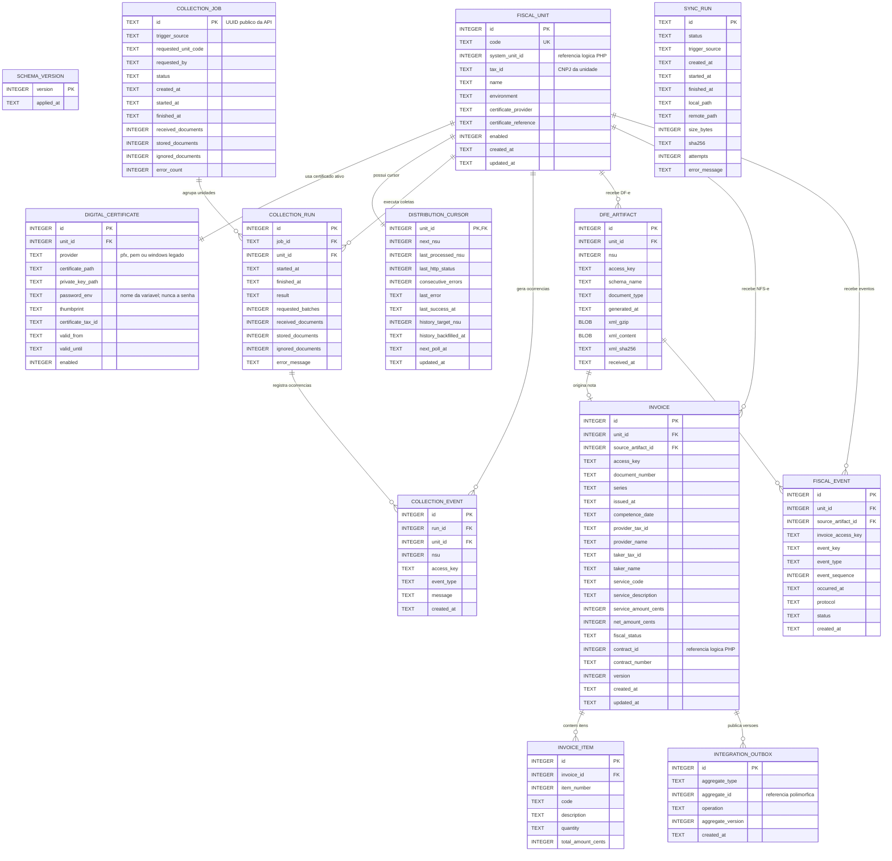
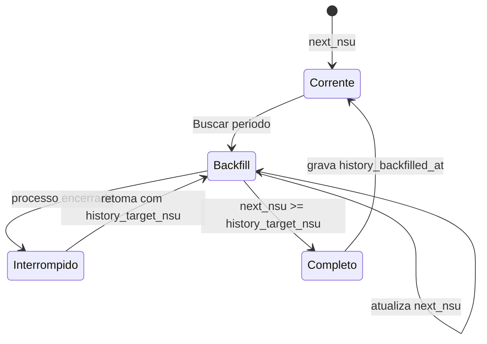
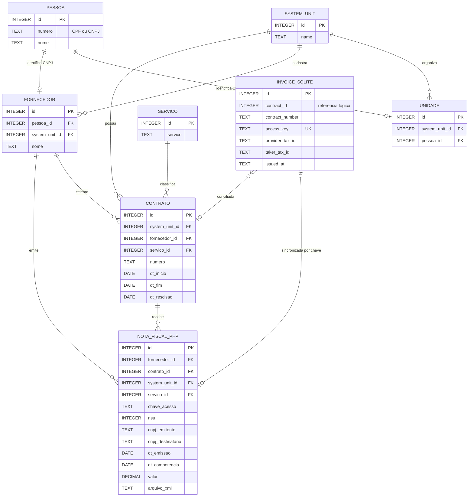
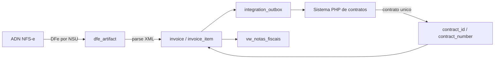

# MER atualizado — TaxLink NFS-e Collector

Versao do modelo: **4**
Banco fisico: **SQLite** (`data/taxlink-nfse.sqlite3`)

## 1. Modelo fisico do coletor

## 2. Responsabilidade das entidades

| Entidade | Responsabilidade |
|---|---|
| `schema_version` | Controla as migracoes aplicadas ao SQLite. |
| `fiscal_unit` | Unidade consultada no ADN, seu CNPJ, ambiente e referencia do certificado. Nao guarda senha ou chave privada. |
| `digital_certificate` | Caminhos e metadados do A1 por unidade. Extrai thumbprint e validade do PFX/PEM; guarda apenas o nome da variavel da senha. `store_location` e nulo para arquivos no Ubuntu e existe somente para compatibilidade Windows legada. |
| `distribution_cursor` | Estado operacional por unidade: proximo NSU, tentativas, agendamento e progresso do backfill historico. |
| `collection_job` | Fila persistente e estado publico de uma solicitacao da API, scheduler ou CLI. |
| `collection_run` | Auditoria de cada ciclo, com lotes solicitados, documentos recebidos/salvos e eventual erro. |
| `collection_event` | Log estruturado de duplicidades e demais ocorrencias da coleta. |
| `dfe_artifact` | Evidencia fiscal original. Preserva XML comprimido, XML consultavel e SHA-256. |
| `invoice` | Cabecalho normalizado da NFS-e e futura referencia ao contrato PHP. |
| `invoice_item` | Itens/servicos extraidos do XML. |
| `fiscal_event` | Eventos fiscais associados pela chave da NFS-e, incluindo o codigo nacional do evento (`event_code`). |
| `integration_outbox` | Fila imutavel de alteracoes para consumo idempotente pelo PHP. |
| `sync_run` | Auditoria da copia consistente e transferencia atomica do espelho por SFTP. |

## 3. Chaves, unicidade e integridade

| Tabela | Regra |
|---|---|
| `fiscal_unit` | `code` e unico; `(tax_id, environment)` tambem e unico. |
| `distribution_cursor` | Relacao 1:1 com `fiscal_unit` por `unit_id`. |
| `dfe_artifact` | `(unit_id, nsu)` e unico. O mesmo NSU com hash XML diferente interrompe o avanço do cursor. |
| `invoice` | `(unit_id, access_key)` e unico. Valores monetarios sao armazenados em centavos. |
| `invoice_item` | `(invoice_id, item_number)` e unico; exclusao da nota remove os itens em cascata. |
| `fiscal_event` | `(unit_id, event_key)` e unico. |
| `integration_outbox` | `(aggregate_type, aggregate_id, operation, aggregate_version)` e unico. |

Indices de consulta:

- artefato por `(unit_id, access_key)`;
- nota por `(unit_id, provider_tax_id)`;
- nota por `(unit_id, taker_tax_id)`;
- nota por `(unit_id, issued_at)`.

## 4. Backfill e cursor NSU

- `history_target_nsu` preserva o cursor que existia antes do retorno ao NSU 1.
- Se houver interrupcao, o alvo permanece gravado para retomada segura.
- `history_backfilled_at` somente e preenchido quando o alvo e alcancado.
- Alterar datas no monitor nao muda diretamente o protocolo do ADN; as datas filtram as notas depois da varredura por NSU.

## 5. Views de consumo

### `vw_notas_fiscais`

Visao operacional solicitada para consulta humana e integracao simples:

| Campo | Origem |
|---|---|
| `Contrato` | `invoice.contract_number` |
| `ID` | `invoice.id` |
| `Contrato ID` | `invoice.contract_id` |
| `Unidade CNPJ` | `fiscal_unit.tax_id` |
| `Fornecedor CNPJ` | `invoice.provider_tax_id` |
| `Data de Emissao` | `invoice.issued_at` |
| `Valor` | `invoice.service_amount_cents / 100` |
| `Competencia` | `invoice.competence_date` |
| `XML` | `dfe_artifact.xml_content` |
| `Chave de Acesso` | `invoice.access_key` |
| `NSU` | `dfe_artifact.nsu` |

### `vw_invoice_outbox`

Contrato de leitura para o sistema PHP. Combina outbox, unidade, nota e artefato sem expor o BLOB do XML na listagem principal.

## 6. MER logico de integracao com o sistema PHP

Os relacionamentos abaixo atravessam bancos diferentes. Portanto sao **referencias logicas**, nao chaves estrangeiras fisicas do SQLite.

## 7. Regras propostas para conciliacao contratual

Uma NFS-e somente deve receber `contract_id` quando houver uma correspondencia unica:

1. `invoice.taker_tax_id` corresponde ao CNPJ da unidade;
2. `invoice.provider_tax_id` corresponde ao CNPJ de `pessoa.numero` do fornecedor;
3. `invoice.issued_at` esta dentro de `contrato.dt_inicio` e `contrato.dt_fim`;
4. contrato nao esta excluido nem rescindido na data de emissao;
5. existe apenas um contrato elegivel para unidade, fornecedor e periodo.

Se houver zero ou mais de um contrato elegivel, a NFS-e permanece sem vinculo automatico e deve entrar em uma fila de conciliacao manual. A chave de acesso e a chave natural para sincronizacao idempotente com `nota_fiscal.chave_acesso`.

## 8. Fluxo de dados

## 9. Observacoes de seguranca e auditoria

- A chave privada do A1 nao e armazenada no SQLite; fica no repositorio de certificados do Windows.
- XML e PDF sao preservados como BLOB, acompanhados de SHA-256.
- A outbox registra cada versao da nota para integracao idempotente.
- `collection_run` e os campos de erro do cursor permitem auditoria operacional.
- `contract_id` no SQLite nao possui FK fisica porque o contrato esta no MySQL do PHP.
